# Adrian Szmajewski | Interactive Business Website


## 🎯 Introduction

Welcome to my interactive business-themed website! 🚀 This project goes beyond static design by integrating **JavaScript** functionality alongside **HTML**, **CSS**, and libraries such as **Bootstrap**, **Google Maps API**, and **EmailJS** for dynamic features.

The website represents a modern, responsive business landing page with real-time interactions such as working contact forms, location mapping, and enhanced UI components. It's designed to simulate a functional business presence and demonstrate front-end development capabilities in action.

🔗 **Live Site:** [Explore the live project](https://adrian77792.github.io/Project2/index.html)  
🔗 **GitHub Repository:** [View the codebase](https://github.com/adrian77792/Project2)

## 🎯 Project Goals

- **Demonstrate Interactive Web Features**  
  This project aims to highlight the use of JavaScript to bring interactivity to a modern website, including functional forms, API integrations, and dynamic UI behavior.

- **Practice Integration of External Services**  
  By using tools like Google Maps and EmailJS, I focused on learning how to incorporate third-party libraries and services into a front-end-only website.

- **Improve Front-End Design with Frameworks**  
  The site uses **Bootstrap** to streamline layout and responsiveness, ensuring the interface remains clean and adaptive across devices.

- **Simulate a Business Landing Page**  
  The project emulates a typical company website structure — with a home, about, services, contact, and location — ideal for client presentation or portfolio purposes.

- **Strengthen UI/UX Skills**  
  From smooth navigation to interactive elements, this project helps sharpen design sensibility while improving code organization and responsiveness.

---
## 📌 Table of Contents
- [Introduction](#-introduction)
- [User Experience (UX)](#-user-experience-ux)
  - [Target Audience](#-target-audience)
  - [User Goals](#-user-goals)
  - [Design](#️-design)
  - [Wireframe Desktop](#-wireframe-desktop-preview)
  - [Wireframe Mobile](#-wireframe-mobile-preview)
  - [Color Scheme](#-color-scheme)
- [Features](#-features)
  - [Home Page](#-home-page)
  - [Services](#️-services)
  - [Construction Calculator](#-construction-calculator)
  - [About Us](#-about-us)
  - [Contact](#-contact)
- [Planned Features](#-planned-features)
- [Technologies Used](#️-technologies-used)
- [Deployment](#-deployment)
- [Testing](#-testing)
- [Credits](#-credits)
- [Acknowledgments](#-acknowledgments)

---

## 🎨 User Experience (UX)

### 🎯 Target Audience
- Individual clients and businesses seeking renovation and finishing services.
- Potential partners or collaborators looking for a trusted construction company.
- Users who want quick access to the company's services, contact details, and location.

### 🧭 User Goals
- **First-time visitors:** Quickly understand the scope of services, explore the photo gallery, and find contact information.
- **Returning visitors:** Reconnect with the company, send inquiries, or check for updates.

### 🖌️ Design
The design prioritizes a clear presentation of services and intuitive user navigation:
- **Professional and modern look:** A structured layout that highlights service offerings, customer reviews, and essential contact information.
- **Simple and intuitive navigation:** A fixed navigation bar with direct links to key sections like "Home", "About", "Gallery", and "Contact".
- **Responsive layout:** Optimized for seamless use on desktops, tablets, and mobile devices.

### 📷 Wireframe Desktop Preview:
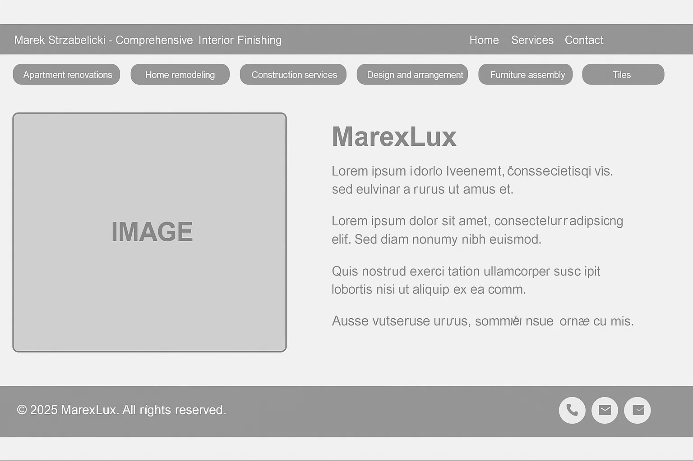
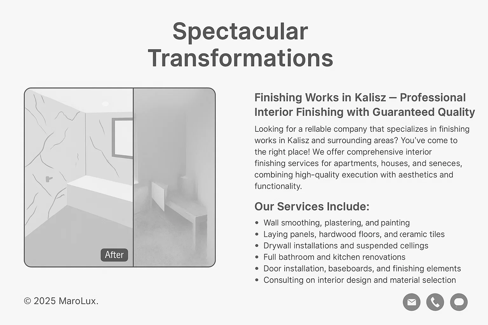
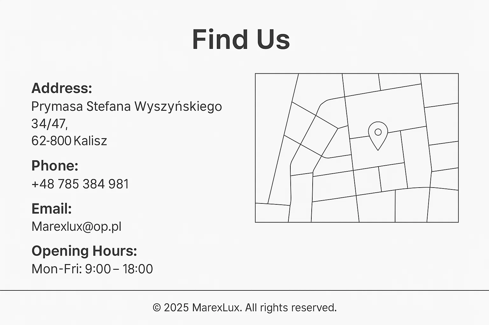
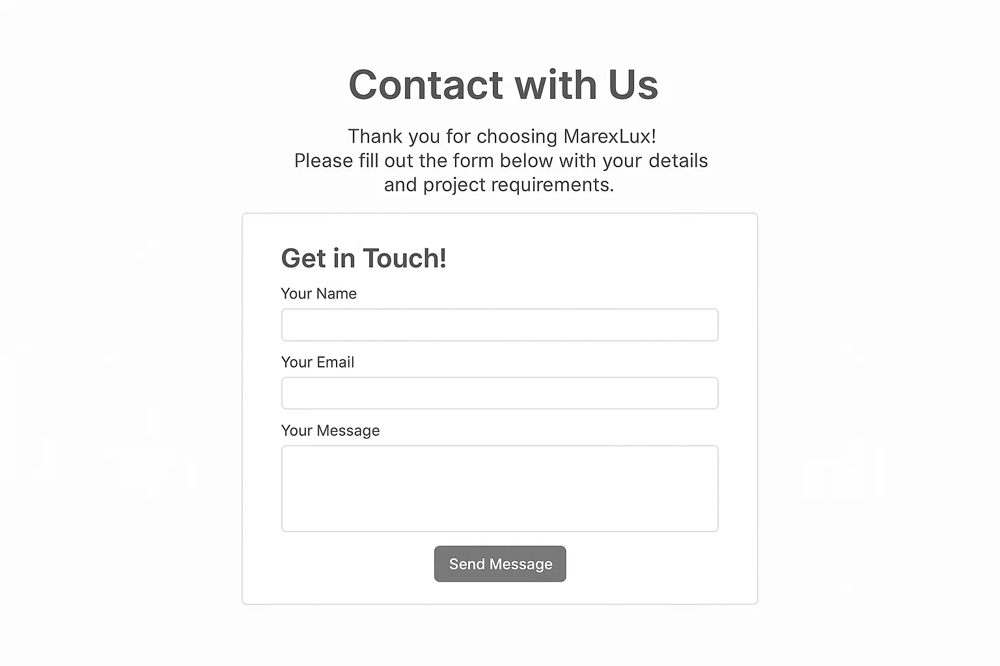
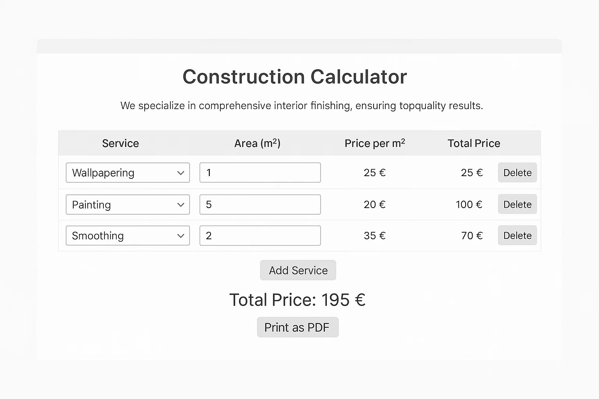

### 📷 Wireframe Mobile Preview:
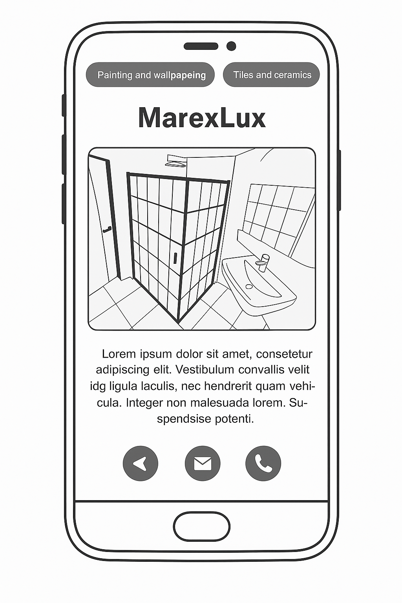
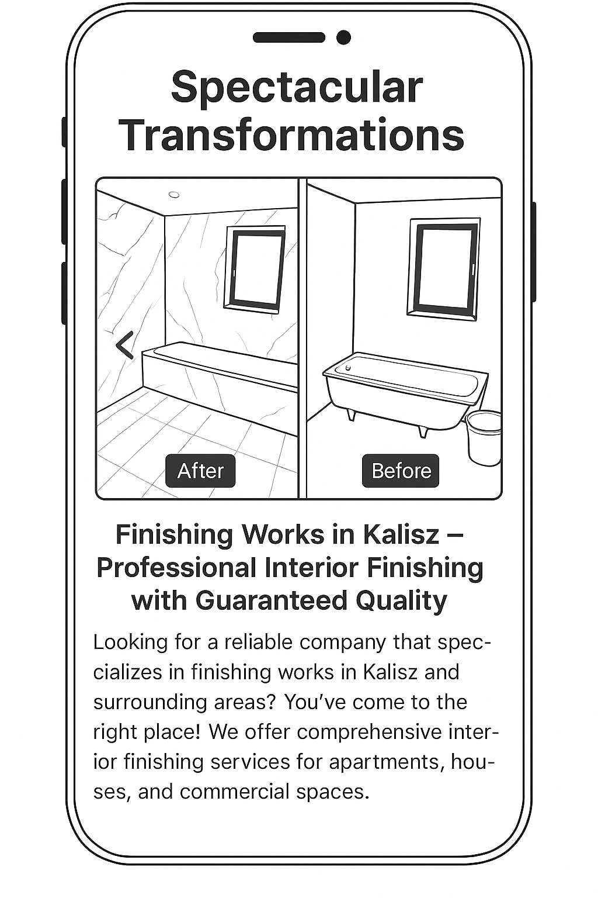
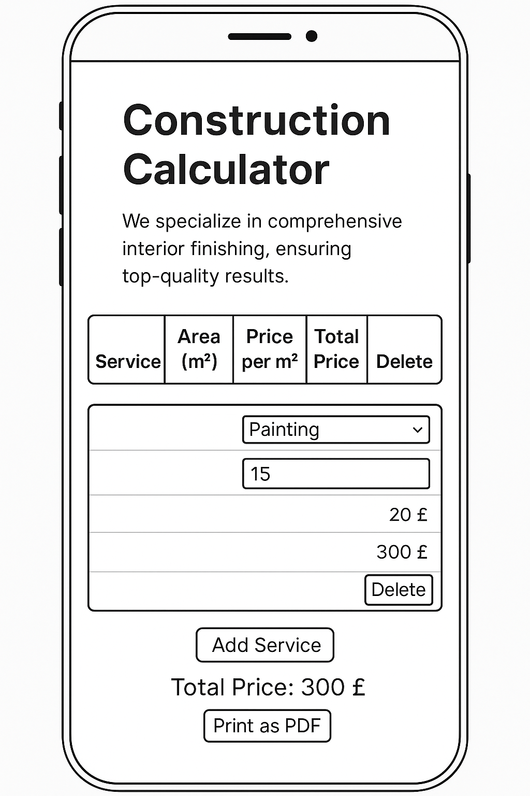

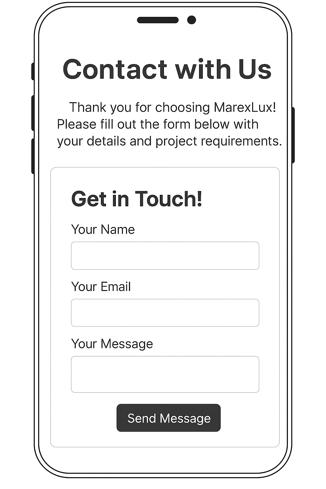

### 🎨 Color Scheme


The website uses a clean, trustworthy color palette associated with reliability and craftsmanship:
- **Accent Colors:** Accent Colors: Black&Red with golden tones – conveying elegance, luxury, and trust.
- **Background:** Soft neutral shades – enhancing readability and maintaining a light, clean aesthetic.
- **Text & Contrast:** Dark text on light backgrounds – ensuring accessibility and clarity.

This UX approach provides an effective and trustworthy user experience while promoting the MarexLux brand as a reliable service provider.

---
## 🔥 Features

### 🏠 Home Page
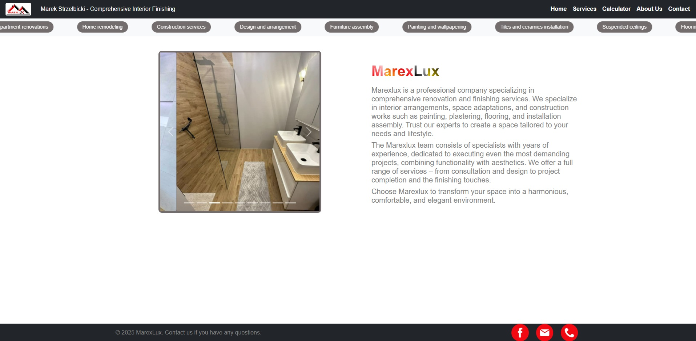

This page showcases the services of MarexLux, a company specializing in interior renovation and finishing. The layout is designed for easy navigation and information access.

*   **Header:** Located at the top of the page, the header contains the company logo ("MarexLux"), main navigation links (Home, Services, Calculator, About Us, Contact), providing quick access to key sections.

*   **Service Navigation:** Below the header, there's a navigation bar with categories of services offered. Examples include "Apartment renovations," "Home remodeling," "Construction services," "Design and arrangement," "Furniture assembly," "Painting and wallpapering," and "Tiles and ceramics." These act as links or buttons to explore specific service areas.

*   **Main Image Carousel:** A prominent image carousel displays examples of completed projects or services. This is usually a visually engaging element to attract visitors and showcase the company's work. Navigation arrows allow users to browse through the images.

*   **Company Description:** To the right of the image carousel, there is a text area providing a description of MarexLux. This section outlines the company's mission, specializations, and approach to providing interior design and finishing services. It emphasizes their professionalism and customer-centric approach.

*   **Footer:** At the bottom of the page, the footer contains copyright information ("© 2025 MarexLux"), a link to follow news and promotions, and social media icons (Facebook, Email, Phone).

### 🛠️ Services
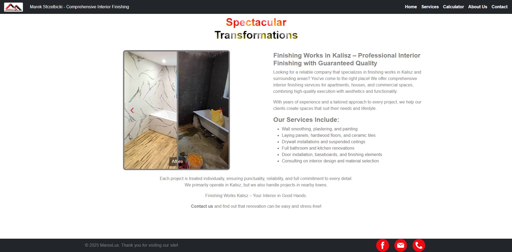

Interior Finishing – Kalisz
🌟 Spectacular Transformations
See the before-and-after results of our renovation projects! We specialize in turning outdated or unfinished spaces into beautiful, functional interiors.

🏠 Finishing Works in Kalisz
We deliver professional interior finishing services with a strong focus on quality craftsmanship, aesthetic appeal, and practical design. Our team is committed to precision and excellence in every detail.

🔧 Service Offerings
Wall smoothing, plastering, and painting

Installation of panels, hardwood flooring, and ceramic tiles

Drywall and suspended ceiling systems

Complete bathroom and kitchen renovations

Door installation, baseboards, and finishing elements

Consulting on interior design and material selection

✅ Commitment to Quality
We pride ourselves on punctuality, reliability, and attention to detail. Every project is carried out with care to ensure full customer satisfaction and long-lasting results.

The Construction Calculator subpage on the Marexlux website provides a tool for estimating renovation costs. Here’s what it includes:

Page Overview
Service Selection – Users can choose different renovation services.

Area Input – Allows users to enter the size of the space in square meters.

Price per m² – Displays the cost per square meter for selected services.

Total Price Calculation – Automatically calculates the total cost based on the input.

Action Buttons – Options to add services and print the estimate as a PDF.

### 📐 Construction Calculator
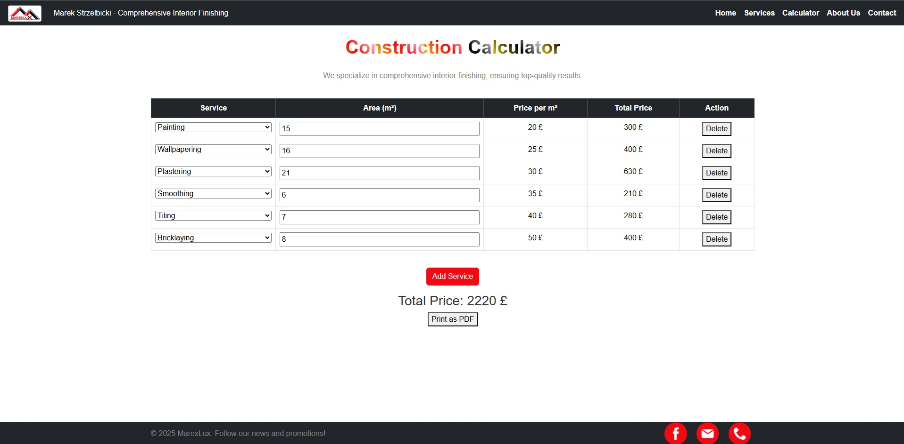

The Construction Calculator on the Marexlux website is an interactive tool designed to help users quickly estimate renovation costs with clarity and ease.

🔍 Page Overview
🛠️ Service Selection
Choose from a variety of renovation and finishing services tailored to your needs.

📏 Area Input
Enter the size of your space in square meters for accurate calculations.

💰 Price per m²
View transparent, up-to-date pricing for each selected service.

🧮 Total Price Calculation
Instantly see the estimated cost based on your selections and input.

🖨️ Action Buttons
Add multiple services to your estimate and print a detailed summary as a PDF.

This tool empowers clients to make informed decisions and plan their renovation budget with confidence.

### 📇 About Us
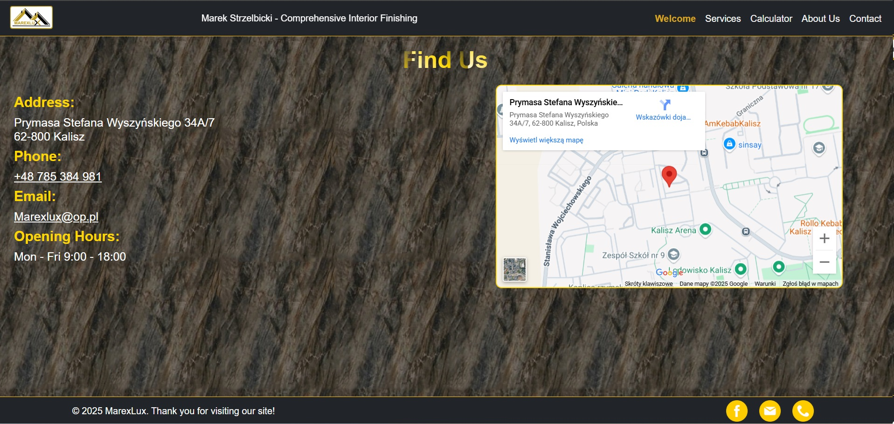

The About Us subpage on the Marexlux website offers essential company information and contact details, providing a quick reference for clients and partners.

🔍 Page Overview
🏢 Company Name & Branding
Features the Marexlux logo and business identity, reinforcing brand recognition.

📍 Address & Location
Physical location in Kalisz for in-person consultations or project evaluations.

☎️ Contact Information

Phone: +48 785 384 981

Email: Marexlux@op.pl

🕘 Opening Hours

Monday to Friday: 9:00 – 18:00

©️ Copyright Notice
All content and materials are © 2025 Marexlux. All rights reserved.

This page ensures customers can easily get in touch, locate the business, or verify service availability during operating hours.

### 📬 Contact
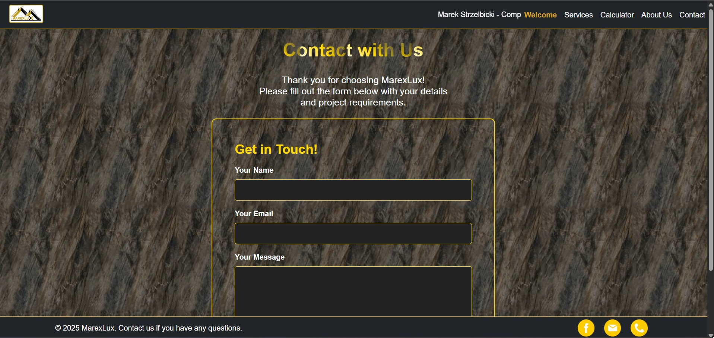

The Contact subpage on the Marexlux website is designed to facilitate easy and efficient communication between users and the company.

🔍 Page Overview
🙏 Welcome Message
A brief note thanking visitors for choosing Marexlux and inviting them to get in touch.

📝 Contact form

Name Field: Enter your full name.

Email Field: Provide your email address for correspondence.

Message Box: Describe your project requirements or ask any questions.

Send Button: Submit your message directly to Marexlux.

©️ Copyright Notice
Website content © 2025 Marexlux.

This page ensures users can quickly reach out with inquiries or project details, streamlining communication for a prompt response.

## 🚧 Planned Features

> This project is under active development. The following features are planned for future updates to enhance functionality, improve user experience, and expand the business use case. Community feedback and contributions are welcome!

- 🛒 **E-commerce module (cart + orders)**  
  Add a shopping cart and order system for showcasing and selling products or services.

- 🌐 **Multilingual support (PL/EN)**  
  Enable users to switch between Polish and English versions of the site.

- 🔍 **Search functionality**  
  Implement a site-wide search bar to help users find content quickly.

- 📅 **Online booking/reservations**  
  Allow visitors to book appointments or services through a calendar interface.

- 💬 **Live chat support**  
  Integrate real-time messaging to improve customer support and engagement.

- 📈 **Visitor analytics**  
  Track site traffic and user behavior using tools like Google Analytics or Matomo.

- 🌙 **Dark mode switch**  
  Give users the option to switch between light and dark themes.

- 🧪 **Unit & end-to-end testing**  
  Introduce testing to ensure code reliability and prevent bugs in production.

- 📄 **Headless CMS integration**  
  Connect a content management system (e.g., Strapi, Netlify CMS) for easy content updates.

## 🛠️ Technologies Used

- **HTML5** – Markup structure
- **CSS3** – Styling
- **JavaScript** – Interactivity
- **Bootstrap 5** – Responsive layout and components
- **Google Maps API** – Embedding dynamic maps
- **EmailJS** – Sending form data to email


## 🌍 Deployment

This project is deployed using **GitHub Pages**, a free hosting service for static websites provided by GitHub.

To deploy your site, follow these steps:

1. **Prepare your repository**: Make sure your project contains the main files like `index.html`, `style.css`, etc. If you haven’t created a GitHub repository yet, you can initialize one and push your code using the following commands:

   ```bash
   git init
   git add .
   git commit -m "Initial commit"
   git branch -M main
   git remote add origin https://github.com/YOUR_USERNAME/YOUR_REPOSITORY.git
   git push -u origin main
   ```

2. **Enable GitHub Pages**:  
   - Go to your repository on GitHub.  
   - Click on **Settings**.  
   - From the left-hand menu, select **Pages**.  
   - Under **Source**, choose the `main` branch and the `/ (root)` folder.  
   - Click **Save**.

3. **Access your live website**:  
   After a few seconds, GitHub will generate a public URL for your website. It typically looks like:  
   ```
   https://your-username.github.io/your-repository/
   ```
   Example:  
   ```
   https://adrian77792.github.io/Project2/
   ```

To clone this repository to your local machine, use:

```bash
git clone https://github.com/adrian77792/Project2.git
```

Now you're all set! 🚀

## ✅ Testing

### 🧪 Scope of Testing
- **Responsiveness**: Verified across multiple device sizes (desktop, tablet, smartphone).
- **Cross-browser compatibility**: Tested on latest versions of Chrome, Firefox, Edge, and Safari.
- **Navigation usability**: Ensured that all links, buttons, and sections work smoothly and intuitively.
- **Form validation**: Tested for correct input handling, error detection, and messaging.
- **HTML and CSS validation**: Checked via W3C [Nu HTML Checker](https://validator.w3.org/nu/) and [W3C CSS Validator](https://jigsaw.w3.org/css-validator/).

---

### 🧩 Test Environments
- **Browsers**: 
  - Google Chrome (Latest)
  - Mozilla Firefox (Latest)
  - Microsoft Edge (Latest)
  - Safari (macOS/iOS)
- **Devices**: 
  - Windows 11 Desktop (1920x1080)
  - Android Smartphone (Pixel 5, Samsung Galaxy S10)
  - iPhone 13
  - iPad Mini
- **Validators**:
  - [Nu HTML Checker](https://validator.w3.org/nu/)
  - [W3C CSS Validator](https://jigsaw.w3.org/css-validator/)

---

### 📋 Detailed Test Scenarios

#### 1. 📱 Responsiveness Testing
- **Steps**:
  - Open the website on various devices and screen sizes.
  - Resize browser windows and rotate mobile devices.
- **Expected Result**:
  - No content overflow or element misalignment.
  - Menu, buttons, and layout adapt gracefully.

✅ **Passed**

---

#### 2. 🌐 Cross-browser Compatibility Testing
- **Steps**:
  - Open the website on Chrome, Firefox, Edge, and Safari.
  - Compare layouts, animations, fonts, and interactions.
- **Expected Result**:
  - Identical or very similar appearance and behavior in all browsers.

✅ **Passed**

---

#### 3. 🧭 Navigation Usability Testing
- **Steps**:
  - Click through all navigation links and internal page anchors.
  - Test all buttons, forms, and interactive elements.
- **Expected Result**:
  - All links work correctly, smooth scrolling behavior is present.

✅ **Passed**

---

#### 4. 🛡️ Form Validation Testing
- **Steps**:
  - Submit the form with missing, incorrect, and correct data.
  - Check for validation errors and success messages.
- **Expected Result**:
  - Proper client-side validation, helpful error messages, successful submission on valid input.

✅ **Passed**

---

#### 5. 🧹 HTML and CSS Validation Testing
- **Steps**:
  - Submit the page URLs to the Nu HTML Checker and W3C CSS Validator.
- **Expected Result**:
  - No critical errors in HTML or CSS.

**Initial Findings**:
- ❌ **Error**: `<title>` and `<style>` elements incorrectly placed inside `<body>`.
- ❌ **CSS Parse Error**: Minor syntax issue in external stylesheet.

**Corrections**:
- 🛠️ Moved `<title>` and `<style>` to inside the `<head>`.
- 🛠️ Fixed CSS syntax errors.

✅ **Final Status**: No validation errors after fixes.

---

### 🔥 Issues Identified and Solutions

| # | Issue | Type | Recommendation | Status |
|:-:|:-----|:----:|:---------------|:------:|
| 1 | `<title>` inside `<body>` | HTML Structure Error | Move to `<head>` section. | ✅ Fixed |
| 2 | `<style>` inside `<body>` | HTML Structure Error | Move to `<head>` section. | ✅ Fixed |
| 3 | CSS parse error (`ap`) | CSS Syntax Error | Correct or remove invalid rule. | ✅ Fixed |
| 4 | Spaces in filenames (e.g., `Adrian Szmajewski.css`) | URL Issue | Encode spaces (`%20`) or replace with underscores (`_`). | ✅ Fixed |

---

### 🏁 Final Testing Summary

- **Responsiveness**: ✅ Verified and working perfectly.
- **Cross-browser compatibility**: ✅ Confirmed across major browsers.
- **Navigation usability**: ✅ Smooth and intuitive.
- **Form validation**: ✅ Correct handling of valid/invalid data.
- **HTML & CSS validation**: ✅ No critical issues after corrections.

> **Overall result**:  
> The project meets modern web development standards in design, performance, accessibility, and code quality.

---

- **Responsiveness:** Verified across different devices.
- **Cross-browser compatibility:** Tested on Chrome, Firefox, Edge, and Safari.
- **Navigation usability:** Ensured smooth and intuitive browsing.
- **Form validation:** Checked for proper input handling.


---
## 📚 Credits

### Sidebar with Social Icons
- Left-side sticky sidebar implemented with icons (e.g., FontAwesome) linking to external profiles (GitHub, LinkedIn).
- Positioned using CSS (fixed position and vertical centering).
- Enhances quick navigation to important resources.

### Bootstrap Container
- Main content structured inside Bootstrap's .container class.
- Provides responsive padding and centers the page content for better readability.
- Ensures the project layout remains clean and responsive across all screen sizes.

### Icons & Fonts
- Google Fonts, Font Awesome.
### Inspiration & Resources
- Various online tutorials and tech communities.

---
## 🙌 Acknowledgments

- *Code Institute*: Provided essential resources and guidance that were fundamental in developing the project.

- *Slack Community*: Offered invaluable support and feedback throughout the development process.

- *New City College – Andre Beckley*: Provided crucial support in correctly completing the project and offered valuable guidance on the documentation, which plays an essential role in the overall success of the project.

📌 *© 2025 Adrian Szmajewski - All rights reserved.*


