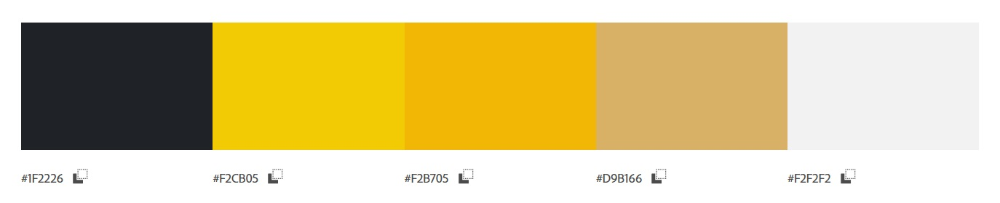

# Adrian Szmajewski | Interactive Business Website

## 🎯 Introduction

Welcome to my interactive business-themed website! 🚀 This project goes beyond static design by integrating **JavaScript** functionality alongside **HTML**, **CSS**, and libraries such as **Bootstrap**, **Google Maps API**, and **EmailJS** for dynamic features.

The website represents a modern, responsive business landing page with real-time interactions such as working contact forms, location mapping, and enhanced UI components. It's designed to simulate a functional business presence and demonstrate front-end development capabilities in action.

🔗 **Live Site:** [Explore the live project](https://adrian77792.github.io/Project2/index.html)  
🔗 **GitHub Repository:** [View the codebase](https://github.com/adrian77792/Project2)

## 🎯 Project Goals

- **Demonstrate Interactive Web Features**  
  This project aims to highlight the use of JavaScript to bring interactivity to a modern website, including functional forms, API integrations, and dynamic UI behavior.

- **Practice Integration of External Services**  
  By using tools like Google Maps and EmailJS, I focused on learning how to incorporate third-party libraries and services into a front-end-only website.

- **Improve Front-End Design with Frameworks**  
  The site uses **Bootstrap** to streamline layout and responsiveness, ensuring the interface remains clean and adaptive across devices.

- **Simulate a Business Landing Page**  
  The project emulates a typical company website structure — with a home, about, services, contact, and location — ideal for client presentation or portfolio purposes.

- **Strengthen UI/UX Skills**  
  From smooth navigation to interactive elements, this project helps sharpen design sensibility while improving code organization and responsiveness.

## Wireframe Figma

🔗 **Figma:** [View my Wireframe on Figma](https://www.figma.com/design/9iFyXgR7lZ2mdYJSimZVvS/Untitled?node-id=6-3&m=dev&t=EwnWsp720oqtiO25-1)

### 📷 Wireframe Preview:

---
## 📌 Table of Contents
- [Introduction](#-introduction)
- [User Experience (UX)](#-user-experience-ux)
  - [Target Audience](#target-audience)
  - [User Goals](#user-goals)
  - [Design](#design)
  - [Wireframe Figma](#wireframe-figma)
  - [Color Scheme](#-color-scheme)
- [Features](#-features)
  - [Home Page](#-home-page)
  - [Skills](#-skills)
  - [Resume](#-resume)
  - [Contact](#-contact)
  - [Footer](#-footer)
- [Future Features](#-future-features)
- [Technologies Used](#-technologies-used)
- [Deployment](#-deployment)
- [Testing](#-testing)
- [Credits](#-credits)
- [Acknowledgments](#-acknowledgments)

---

## 🎨 User Experience (UX)

### 🎯 Target Audience
- Individual clients and businesses seeking renovation and finishing services.
- Potential partners or collaborators looking for a trusted construction company.
- Users who want quick access to the company's services, contact details, and location.

### 🧭 User Goals
- **First-time visitors:** Quickly understand the scope of services, explore the photo gallery, and find contact information.
- **Returning visitors:** Reconnect with the company, send inquiries, or check for updates.

### 🖌️ Design
The design prioritizes a clear presentation of services and intuitive user navigation:
- **Professional and modern look:** A structured layout that highlights service offerings, customer reviews, and essential contact information.
- **Simple and intuitive navigation:** A fixed navigation bar with direct links to key sections like "Home", "About", "Gallery", and "Contact".
- **Responsive layout:** Optimized for seamless use on desktops, tablets, and mobile devices.

### 🎨 Color Scheme

The website uses a clean, trustworthy color palette associated with reliability and craftsmanship:
- **Accent Colors:** Accent Colors: Black&Red with golden tones – conveying elegance, luxury, and trust.
- **Background:** Soft neutral shades – enhancing readability and maintaining a light, clean aesthetic.
- **Text & Contrast:** Dark text on light backgrounds – ensuring accessibility and clarity.

This UX approach provides an effective and trustworthy user experience while promoting the MarexLux brand as a reliable service provider.

## PROJECT2
Project Objective
The aim of the project is to create a modern, functional, and visually appealing website for Marex Lux, a company specializing in comprehensive renovation and interior finishing services. The website is intended to:

Clearly present the company’s service offerings,

Showcase the team’s experience and professionalism,

Allow customers to easily get in touch and request service estimates,

Increase the company’s online visibility and attract new clients,

Build trust through a portfolio of completed projects and positive feedback.

The website should be intuitive, responsive (optimized for mobile devices), and compliant with modern web design standards.

## PAGES
- About_Us.html – about us
- Calculator.html – simple calculator
- Contact.html – contact form
- Services.html – description of services
- Marek.html – profile

## How to run?

1. Download the repository:
git clone https://github.com/adrian77792/Project2

2. Open the HTML file in your browser.

## Technologies

- HTML
- CSS
- JavaScript

